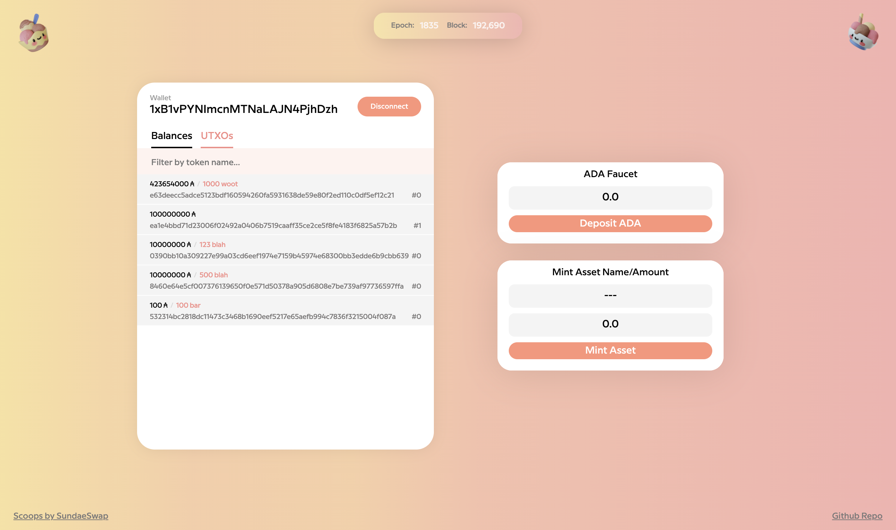

toolkit-for-cardano
------------------



`toolkit-for-cardano` simplifies the development of Cardano smart contracts 
by providing teams with frequently needed tasks:

* Build Transactions
* Sign Transactions
* Submit Transactions
* Mint Tokens
* Create Wallet
* Fund Wallet
* Transfer Funds
* Calculate Fees

`toolkit-for-cardano` is not intended as a replacement for a wallet, but rather as a
development tool to allow teams to make progress with minimal wallet integration overhead.

### Prerequisites

Before launching `toolkit-for-cardano`, you'll need to identify an address that will be considered
the Treasury™ address.  This address will be used to fund all other addresses.  Make sure that
(a) the UTXO in this address only contain ADA and no other tokens and (b) each UTXO has a large
quantity of ADA as the tool currently only uses a single TxIn for funding.

If you've just configured your private testnet and would like create a treasury address and then
fund it, you can use the scripts provided:

```
scripts/generate-address.sh treasury                       # generates files including treasury.addr
TESTNET_MAGIC=31415 scripts/fund-treasury.sh treasury.addr # sends the initial funds to the treasury.addr address
```

* ensure `CARDANO_NODE_SOCKET_PATH` is set
* ensure `CARDANO_NODE_HOME` is set to your testnet root dir if other than `${HOME}/alonzo-testnet`

### Quick Start

1. clone this repository
2. edit `docker-compose.yml` adjust `/home/ubuntu/alonzo-testnet` to your testnet root
3. ensure that your treasury keys are in `./addresses/treasury.*` 
4. ensure that your treasury address is funded
5. docker-compose up -d

Done!

This will launch:

* `cardano-db-sync-extended`
* `postgres` on port 5432
* `toolkit-for-cardano` on port 3200

## Important

To enable `cardano-db-sync-extended` on a private testnet, we used an 
unmerged branch of `input-output-hk/cardano-db-sync`, `kderme/fix-fork-at-0`, 
that resolves an issue working against private testnets. https://github.com/input-output-hk/cardano-db-sync/pull/766  

It does appear that this branch still has issues.  Specifically, if you need
to restart the `cardano-db-sync-extended`, you will need to delete the 
docker volumes before restarting as there appears to be some issue with
continuing.

```
docker-compose rm -fv && docker volume rm $(docker volume ls | awk '{print $2}' | grep -v VOLUME)
```

* this may grab other unused volumes

## Building 

#### docker image

```docker build -t sundaeswap/toolkit-for-cardano .```


#### self contained cli

Assuming go 1.16 or better and node 1.14 or better are installed 

```
(cd ui && yarn install && yarn local:build)
GOOS=linux go build
```

Change GOOS to match your target OS e.g. darwin, linux, windows, etc

## Concepts

#### Minting

Minted tokens are in the namespace of the wallet that generated them.  That
wallet can mint as many or few tokens as it wishes.  However, tokens minted by
one wallet are not fungible with tokens minted by another wallet.

#### Wallets

`toolkit-for-cardano` generates only the loosest concept of a wallet.  It makes no
attempt at securing the wallet as it is designed for development purposes only.

Because the wallet is just a string, it simplifies the interaction with the
frontend as it can put in a cookie, local storage, whatever is convenient.

#### Treasury

The treasury wallet is any wallet with sufficient ADA to fund other wallets.  
Most often, this will be the wallet funded via the faucet.  `toolkit-for-cardano`
will need access to the wallet address as well as the signing key (.skey)


